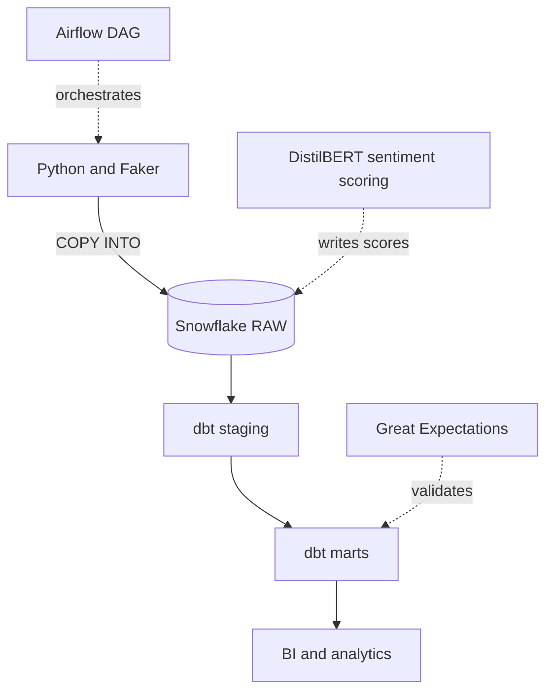
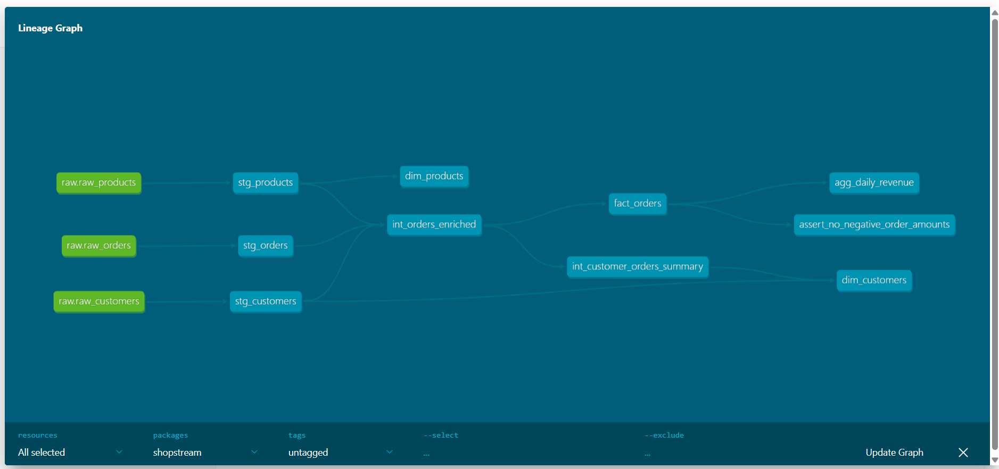
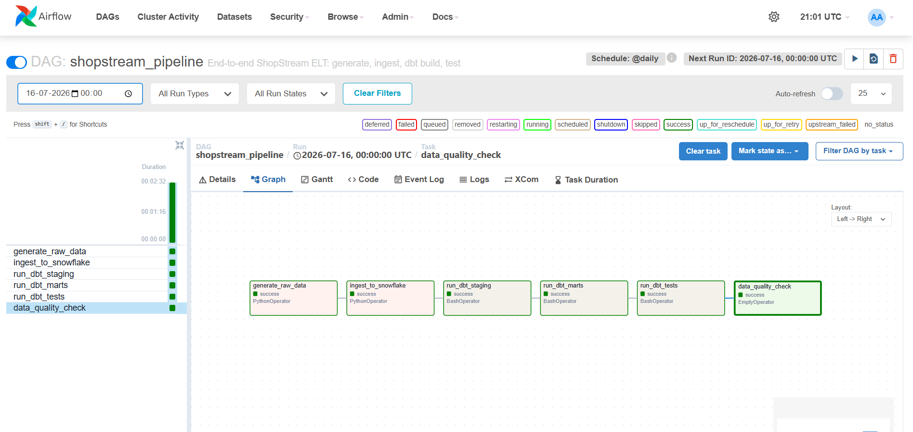

# ShopStream Analytics Platform

[](https://github.com/Prasanna38430/shopstream-analytics/actions/workflows/ci.yml)

An end-to-end ELT pipeline for a fictional e-commerce company called ShopStream. Synthetic order, customer, and product data is loaded into Snowflake, transformed with dbt into a star schema, orchestrated by Airflow, and checked with Great Expectations. Product reviews are scored by a pretrained sentiment model and rolled up per product. Every push to GitHub runs the tests.

I put this together to get properly hands-on with Snowflake and dbt. I'd used Airflow and BigQuery before but wanted a single project that ran the whole way through, from raw data to tested marts, instead of a folder of disconnected scripts. Everything here is reproducible: the data is generated from a seeded script, and the warehouse itself is created from SQL that lives in the repo.

## Architecture



The warehouse is split into three schemas following the medallion pattern, and data only ever moves in one direction:

- **RAW** holds the data exactly as it landed. Nothing is cleaned here. If a downstream model breaks I can always rebuild from this layer without re-ingesting.
- **STAGING** is one cleaned model per source table. Types get cast, columns renamed, nulls handled, and duplicate customers collapsed. No business logic yet.
- **MARTS** is where the joins and aggregations happen: the fact table, the dimensions, and a daily rollup that a dashboard would sit on top of.

## How it runs

The pipeline is a single Airflow DAG (`shopstream_pipeline`) with six tasks that run in order:

1. `generate_raw_data` writes three CSVs with Faker. The generator deliberately introduces messy data, more on that below.
2. `ingest_to_snowflake` uploads the CSVs to an internal stage and runs `COPY INTO` to bulk-load the RAW tables.
3. `run_dbt_staging` builds the staging views.
4. `run_dbt_marts` builds the fact and dimension tables.
5. `run_dbt_tests` runs the full dbt test suite.
6. `data_quality_check` runs the Great Expectations suites.

Great Expectations conflicts with dbt on a couple of shared dependencies, so it can't share the Airflow image. That last task runs it in a throwaway virtualenv instead, which keeps the two toolchains from stepping on each other.

## Data model

The marts layer is a star schema: one fact table at order grain, surrounded by two dimensions.

```
fact_orders  ──┬── dim_customers
               └── dim_products
```

`agg_daily_revenue` is a pre-aggregated daily rollup built on top of the fact table. `fact_orders` is materialized incrementally, so a daily run only processes new orders rather than rebuilding the whole table.

## Review sentiment

Alongside orders, the generator produces 3,000 product reviews. A pretrained DistilBERT model reads each review and scores it, and those scores feed a `product_sentiment` mart. That lets you rank products by how customers actually talk about them, not just by star rating.

Snowflake Cortex was the original plan for this, but its AI functions are blocked on trial accounts, so the scoring runs locally with Hugging Face transformers instead. PyTorch is heavy and only needed for this one step, so it lives in its own environment (`requirements-ml.txt`) and stays out of CI and the Airflow image. Everything downstream just reads the scored table.

The model only ever sees the review text, never the star rating, which makes the result a useful check on itself:

| Star rating | Reviews | Average sentiment |
|---|---|---|
| 1 | 211 | -1.00 |
| 2 | 248 | -1.00 |
| 3 | 445 | -0.05 |
| 4 | 892 | 1.00 |
| 5 | 1204 | 1.00 |

Three-star reviews land almost exactly on zero, which is roughly what you'd hope for.

## By the numbers

The generator produces 100,000 orders, 10,000 customers, 500 products, and 3,000 reviews on each run. After the staging layer does its cleanup:

- 158 duplicate customer emails are collapsed, leaving 9,839 unique customers
- 16 different spellings of country (US, USA, United States, and so on) become 7 ISO codes
- 303 orders with a zero or negative amount are dropped
- `fact_orders` ends up around 98,000 rows after keeping only orders that reference a customer surviving the dedup
- all 3,000 reviews get scored, 2,293 positive and 707 negative, covering 498 of the 500 products

Quality is checked from a few angles: 35 dbt tests (uniqueness, not-null, accepted values, and referential integrity between the fact and its dimensions), a custom test asserting no negative amounts, 12 Great Expectations expectations, and 4 Python unit tests on the generator.

## Screenshots

dbt lineage, from the three raw sources through staging and into the marts:



The Airflow DAG after a clean run:



## Repository layout

```
shopstream-analytics/
├── snowflake/            SQL to create the warehouse, role, and schemas
├── ingestion/           data generator and the Snowflake loader
├── dbt/shopstream/      dbt project: staging, intermediate, marts, tests, macros
├── airflow/             docker-compose and the pipeline DAG
├── great_expectations/  the data quality suites
├── tests/               Python unit tests
├── .github/workflows/   CI and CD
├── requirements.txt          dbt, ingestion, and test dependencies
├── requirements-quality.txt  Great Expectations (separate env)
└── requirements-ml.txt       sentiment model (separate env)
```

## Running it yourself

You'll need Python 3.11, Docker, and a Snowflake account. The free trial is more than enough.

Set up the Python environment and credentials:

```bash
git clone https://github.com/Prasanna38430/shopstream-analytics.git
cd shopstream-analytics
py -3.11 -m venv .venv
source .venv/Scripts/activate      # Git Bash on Windows
pip install -r requirements.txt

cp .env.example .env               # fill in your Snowflake details
```

Create the warehouse and schemas by running the scripts in `snowflake/` (01 then 02) in a Snowflake worksheet. Then generate and load the data, and build the models:

```bash
python ingestion/generate_data.py
python ingestion/load_to_snowflake.py

cd dbt/shopstream
dbt deps
dbt build
```

To run the whole thing on a schedule instead, bring up Airflow:

```bash
cd airflow
docker compose up airflow-init   # one time
docker compose up -d
```

The UI is at http://localhost:8080 (admin / admin). Unpause `shopstream_pipeline` and trigger it.

Great Expectations installs into its own environment because of the dependency clash with dbt:

```bash
py -3.11 -m venv .venv-ge
source .venv-ge/Scripts/activate
pip install -r requirements-quality.txt
python great_expectations/validate_marts.py
```

The sentiment scoring also gets its own environment, since PyTorch is only needed for that one step. Run it after loading the raw data and before building the marts:

```bash
py -3.11 -m venv .venv-ml
source .venv-ml/Scripts/activate
pip install torch --index-url https://download.pytorch.org/whl/cpu
pip install -r requirements-ml.txt
python ingestion/score_reviews.py
```

On Windows, if your project path is long, create that venv somewhere short like `C:\venvs\ml` instead. PyTorch nests its files deeply enough to hit the 260-character path limit.

## A few decisions worth explaining

**Deduplicating customers costs some orders.** Staging collapses customers that share an email down to one record. That means a small number of orders point at a customer id that no longer exists in the dimension. Rather than let those become orphan rows, `fact_orders` inner-joins to the dimensions, so those orders drop out. It's a trade-off: the fact table stays referentially clean at the cost of losing roughly 1.6% of orders. For an analytics warehouse I'd rather have integrity than completeness, but it's the kind of thing worth flagging to stakeholders.

**CI builds into its own schemas.** The CI workflow runs against real Snowflake, but a target-name check in the `generate_schema_name` macro sends its output to `CI_STAGING` and `CI_MARTS`. Pull requests get tested against the warehouse without any risk to the real tables.

**Nothing sensitive is committed.** Credentials live in a gitignored `.env` locally, in `env_file` for the Airflow containers, and in GitHub Actions secrets for CI. Generated CSVs aren't committed either, since they can be regenerated from the seeded script. The warehouse auto-suspends after 60 seconds so an idle trial doesn't burn through credits.

## Things I'd add next

If I kept going, the obvious next steps would be snapshots on the customer dimension to track changes over time, source freshness alerting wired to something like Slack, and a small dashboard on top of `agg_daily_revenue` to close the loop visually.
