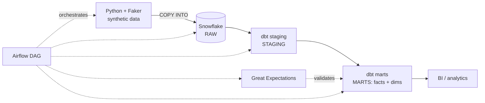

# ShopStream Analytics Platform

An end-to-end ELT pipeline for a fictional e-commerce company, built on the modern data stack. Raw order, customer, and product data is ingested into Snowflake, transformed through dbt into a clean star schema, orchestrated with Airflow, and validated with Great Expectations — with CI running on every push.

I built this to get hands-on with Snowflake and dbt and to have a realistic, reproducible pipeline I could point to rather than a notebook full of one-off scripts.

## Architecture



Data moves through three schema layers, following the medallion pattern:

- **RAW** — landing zone, loaded exactly as it arrives, no transformations
- **STAGING** — cleaned and typed by dbt: casts, renames, null handling, dedup
- **MARTS** — business-ready star schema (`fact_orders`, `dim_customers`, `dim_products`, plus a daily revenue rollup)

## Stack

| Layer | Tool |
|-------|------|
| Warehouse | Snowflake |
| Transformation | dbt Core |
| Ingestion | Python (snowflake-connector, Faker) |
| Orchestration | Apache Airflow (Docker) |
| Data quality | Great Expectations |
| CI/CD | GitHub Actions |

## Data model

The marts layer is modeled as a star schema — one fact table at order grain surrounded by conformed dimensions.

```
fact_orders  ──┬── dim_customers
               └── dim_products
```

`agg_daily_revenue` sits on top of the fact table as a pre-aggregated rollup for dashboards.

## Project layout

```
shopstream-analytics/
├── snowflake/        SQL setup scripts (warehouse, role, schemas)
├── ingestion/        data generation + Snowflake load
├── dbt/shopstream/   dbt project (staging, intermediate, marts)
├── airflow/          docker-compose + the pipeline DAG
├── great_expectations/   data quality suites
├── tests/            Python unit tests
└── .github/workflows/    CI/CD
```

## Getting started

You'll need Python 3.11, Docker, and a Snowflake account (the free trial is plenty).

```bash
# clone and set up the environment
git clone <your-repo-url>
cd shopstream-analytics
py -3.11 -m venv .venv
source .venv/Scripts/activate        # Windows / Git Bash
pip install -r requirements.txt

# configure Snowflake credentials
cp .env.example .env                 # then fill in your values

# create the warehouse, role, and schemas
# run snowflake/01_setup_warehouse.sql and 02_setup_schemas.sql
# in a Snowflake worksheet
```

Great Expectations has dependencies that clash with dbt, so it lives in its own environment (`requirements-quality.txt`) — see the data quality section when you get there.

## Status

Work in progress, built in phases. Done so far:

- [x] Project scaffold, Snowflake warehouse + schemas, credential handling
- [x] Raw data ingestion — 110.5k rows loaded into RAW
- [x] dbt staging models — dedup, type casting, standardized values
- [x] dbt marts — star schema, incremental fact table
- [ ] Tests, docs, and lineage
- [ ] Airflow orchestration
- [ ] Great Expectations suites
- [ ] CI/CD

## Notes

Secrets stay in a gitignored `.env` — only `.env.example` is committed. Generated CSVs aren't committed either; they're reproducible from the generator script. The Snowflake warehouse auto-suspends after 60 seconds to keep trial credits from draining.
